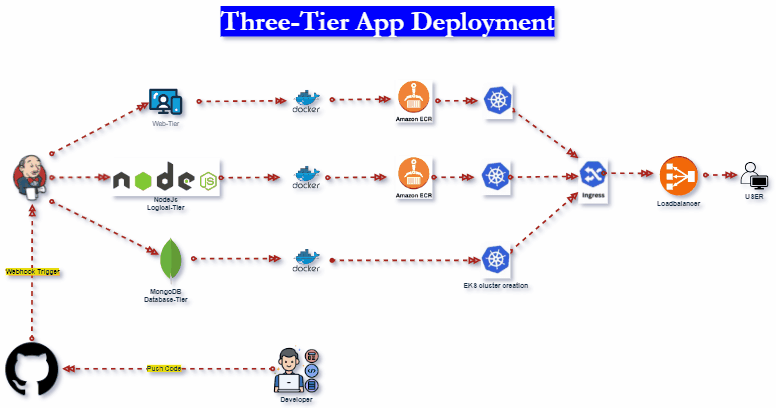

# Three-Tier-App-Deployment

## Prerequisites

### AWS Account
**Details:** Ensure you have an AWS account set up with access to ECR and EKS services. You'll need the AWS CLI installed and configured with your AWS credentials.

### Kubernetes Cluster
**Details:** Set up a Kubernetes cluster using EKS. Ensure kubectl is configured to interact with your EKS cluster.

### Jenkins Server
**Details:** Set up Jenkins with the necessary plugins:
- **Docker Plugin:** For building Docker images.
- **Kubernetes Plugin:** For deploying to Kubernetes.
- **AWS ECR Plugin:** For pushing images to ECR.
- **GitHub Plugin:** For triggering builds from GitHub.

## Setup Instructions

### 1. Clone the Repository
**Purpose:** Retrieve the project files.

**Details:** Use git clone to download the repository and navigate into the project directory.

```bash
git clone https://github.com/yourusername/three-tier-app.git
cd three-tier-app
```

### 2\. Configure Jenkins

**Set up Jenkins with the necessary plugins and credentials:**

**AWS Credentials:** Configure AWS credentials in Jenkins for accessing ECR and EKS.
    
**Docker:** Ensure Docker is installed and configured on the Jenkins server.
    
**GitHub Webhook:** Set up a GitHub webhook to trigger the Jenkins pipeline on code pushes.
    

**Details:**

**AWS Credentials:** In Jenkins, add AWS credentials (Access Key ID and Secret Access Key) for accessing AWS services.

**Docker:** Ensure Docker is installed on the Jenkins server and the Jenkins user has permissions to run Docker commands.

**GitHub Webhook:** In your GitHub repository, set up a webhook to notify Jenkins of code changes. The webhook URL should be in the format http:///github-webhook/.

### 3\. Jenkins Pipeline Configuration

**Purpose:** Automate the build and deployment process using Jenkins.

**Details:** The Jenkinsfile defines the stages for logging into AWS ECR, building Docker images, pushing them to ECR, deploying them to Kubernetes, setting up the Nginx Ingress controller, and printing the load balancer DNS.

### Enviroment Variables
pipeline {
    agent any
    environment {
        AWS_REGION = 'us-east-1'   		//'your-aws-region'
        AWS_ACCOUNT_ID = '975049995182'		//'your-aws-account-id'
        ECR_REPOSITORY_1 = 'public.ecr.aws/w2k2d3f8/frontend:latest'	//'your-ecr-repo-1'
        ECR_REPOSITORY_2 = 'public.ecr.aws/w2k2d3f8/backend:latest'	//'your-ecr-repo-2'
        DOCKER_IMAGE_1 = 'frontend'		//'frontend'
        DOCKER_IMAGE_2 = 'backend'		//'backend'
        KUBE_NAMESPACE = 'default'		//'default'
        INGRESS_NAMESPACE = 'ingress-nginx'	//'ingress-nginx'
        CLUSTER_NAME = '3-tier-cluster'
        AWS_ACCESS_KEY_ID = credentials('aws-access-key')
        AWS_SECRET_ACCESS_KEY = credentials('aws-secret-key')        
        SLACK_CHANNEL = '#your-slack-channel'  // Replace with your Slack channel
        SLACK_CREDENTIAL_ID = 'slack-webhook'  // The ID of your Slack webhook credentials in Jenkins
    }


### Login to AWS ECR

    stages {
        stage('Login to AWS ECR') {
            steps {
                script {
                    sh '''
                    aws ecr-public get-login-password --region ${AWS_REGION} | docker login --username AWS --password-stdin public.ecr.aws/w2k2d3f8
                    '''
                }
            }
        }


### Configure kubectl for EKS

        stage('Configure kubectl for EKS') {
            steps {
                script {
                    sh '''
                    aws eks update-kubeconfig --name ${CLUSTER_NAME} --region ${AWS_REGION}
                    '''
                }
            }
        }

#### Build, Tag, and Push Docker Images
        stage('Build, Tag, and Push Docker Images') {
            steps {
                script {
                    // Build and push the first Docker image
                    sh '''
                    docker build -t ${DOCKER_IMAGE_1} -f ./Docker/frontend/Dockerfile Docker/frontend/
                    docker tag ${DOCKER_IMAGE_1}:latest ${ECR_REPOSITORY_1}
                    docker push ${ECR_REPOSITORY_1}
                    '''

                    // Build and push the second Docker image
                    sh '''
                    docker build -t ${DOCKER_IMAGE_2} -f ./Docker/backend/Dockerfile Docker/backend/
                    docker tag ${DOCKER_IMAGE_2}:latest ${ECR_REPOSITORY_2}
                    docker push ${ECR_REPOSITORY_2}
                    '''
                }
            }
        }

### Deploy Frontend, Backend, and MongoDB
        stage('Deploy Frontend, Backend, and MongoDB') {
            steps {
                script {
                    sh '''
                    kubectl apply -f ./K8s/frontend --namespace ${KUBE_NAMESPACE}
                    kubectl apply -f ./K8s/backend --namespace ${KUBE_NAMESPACE}
                    kubectl apply -f ./K8s/mongo-db --namespace ${KUBE_NAMESPACE}

                    '''
                }
            }
        }

### Deploy Nginx Ingress Controller
        stage('Deploy Nginx Ingress Controller') {
            steps {
                script {
                    sh '''
                    kubectl create namespace ${INGRESS_NAMESPACE} || true
                    helm repo add ingress-nginx https://kubernetes.github.io/ingress-nginx
                    helm repo update
                    helm install nginx-ingress ingress-nginx/ingress-nginx --namespace ${INGRESS_NAMESPACE}
                    '''
                }
            }
        }

### Initialize Nginx Ingress Controller
        stage('Initialize Nginx Ingress Controller') {
            steps {
                sleep time: 20, unit: 'SECONDS'
                echo 'Nginx Ingress Controller initialization complete.'
            }
        }

### Deploy Ingress Resource
        stage('Deploy Ingress Resource') {
            steps {
                script {
                    sh '''
                    kubectl apply -f ./K8s/ingress.yaml --namespace ${KUBE_NAMESPACE}
                    '''
                }
            }
        }

### Fetch Load Balancer DNS
        stage('Fetch Load Balancer DNS') {
            steps {
                sleep time: 30, unit: 'SECONDS'
                echo 'Load Balancer initialization complete.'
            }
        }

### Print DNS of Load Balancer
        stage('Print DNS of Load Balancer') {
            steps {
                script {
                    def ingressName = "main-ingress"
                    def namespace = "${KUBE_NAMESPACE}"
                    def loadBalancerDNS = sh(script: "kubectl get ing ${ingressName} --namespace ${namespace} -o jsonpath='{.status.loadBalancer.ingress[0].hostname}'", returnStdout: true).trim()
                    echo "Load Balancer DNS: ${loadBalancerDNS}"
                }
            }
        }
    }


### 4\. Build and Deploy

**Purpose:** Trigger the Jenkins pipeline by pushing changes to GitHub.

**Details:** When code is pushed to GitHub, the webhook triggers the Jenkins pipeline, which automates the build and deployment process.

### 5\. Access the Application

**Purpose:** Access the deployed application.

**Details:** The DNS name of the AWS Load Balancer, printed by the Jenkins pipeline, can be used to access the application in a web browser.

Files and Directories
---------------------

   **Docker/frontend/Dockerfile:** Dockerfile for the web tier.
    
   **Docker/backend/Dockerfile:** Dockerfile for the logical tier.
    
   **k8s:** Directory containing Kubernetes deployment files.
    
    *   **/frontend:** Deployment files for the web tier.
        
    *   **/backend:** Deployment files for the logical tier.
        
    *   **/mongo:** Deployment files for the database tier.
        
   **ingress.yaml:** Deployment file for the ingress routing.
    
   **Jenkinsfile:** Jenkins pipeline script.
    

**Detailed Explanation:**

*   **Docker/frontend/Dockerfile:** Contains instructions to build the Docker image for the web tier.
    
*   **Docker/backend/Dockerfile:** Contains instructions to build the Docker image for the logical tier.
    
*   **k8s:** Directory containing YAML files for deploying the application to Kubernetes.
    
    *   **/frontend:** Specifies the deployment configuration for the web tier.
        
    *   **/backend:** Specifies the deployment configuration for the logical tier.
        
    *   **/mongo:** Specifies the deployment configuration for the database tier.
        
*   **ingress.yaml:** Specifies the ingress rules for routing traffic to the services.
    
*   **Jenkinsfile:** Defines the Jenkins pipeline script, outlining the steps for building, pushing, and deploying the application.
    

Conclusion
----------

This project automates the deployment of a three-tier application using CI/CD principles. The integration of Jenkins, Docker, Amazon ECR, and Kubernetes ensures a smooth and efficient deployment process, providing a scalable and robust architecture for the application.
